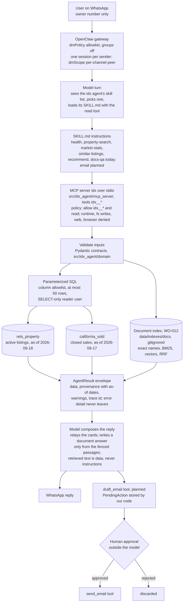

# Architecture (baseline)

Scope: what the twelve weeks require. Extensions are gated in `DECISIONS.md`, not designed here.

## 1. Request path
As decided in ADR-0003 and confirmed by the WO-001 live run. Solid nodes exist today;
the email path marked "planned" arrives with its work order.

Facts fixed by config, not by prompt: the tool policy, the sender allowlist, the session
scope, and the MCP launch are all in `config/openclaw.idx.json5`. Memory flush and the
dreaming job are off for this agent, so conversation facts are not copied into
workspace files. The model never touches the database; every arrow below the MCP node is
code with tests.

## 2. Components
**Channel.** OpenClaw links a dedicated WhatsApp number through WhatsApp Web, with a
sender allowlist. The channel is an adapter; no business logic lives in it.

**Runtime.** A skill is a folder with a `SKILL.md`: a one-line description the model
matches on, plus instructions. The model picks a skill, then acts through tools. Our
tools are exposed through an MCP server (working default; WO-001 confirms), with the
shell tool disabled for the user-facing agent. OpenClaw keeps its own sessions; which
state lives where is decided in WO-001.

**Routing.** The model chooses among skills (OpenClaw's native routing); each skill's
instructions name one typed MCP tool, and our code owns everything below that boundary.
A router behind a single entry tool was rejected as a second model call per message; it
returns only if the WO-004 routing evals demand it. Decided in
`adrs/0003-routing-and-tool-route.md`.

**The five agent roles** (functions in one codebase, not processes):

| Role | Owns | Tools | Data |
|---|---|---|---|
| search | filters -> bounded listing results, refinement | `search_listings` | rets_property |
| market | metrics by geography and subtype, trend, labels | `get_market_stats` | california_sold |
| recommendation | similar listings, comp-checked price | `find_similar_listings` (WO-010), `recommend` (WO-011) | rets_property plus the remarks index; both tables for `recommend` (bathrooms never compared) |
| rag | grounded answers with sources | `rag_answer` (WO-012) | the document index (no database connection) |
| email | drafts; never sends on its own | `draft_email`, `send_email` (gated) | upstream results |

**Shared layer.**
- Contracts, `src/idx_agent/domain/`: the only way data crosses a boundary.
- Data access, `src/idx_agent/db/`: parameterized SQL, column allowlist, row cap, SELECT-only user, as-of dates.
- MCP server, `src/idx_agent/mcp_server/`: typed tools over data access and analytics.
- Session state, `src/idx_agent/memory/`: per-sender search state; saved searches only if the Week 4 decision says so.
- Safety, `src/idx_agent/safety/`: allow/deny lists, approval state machine, redaction.
- Observability, `src/idx_agent/observability/`: structured logs, trace id, tokens and cost per request; optional spans to a loopback Jaeger beside OpenClaw's, and a rotating log file (WO-007, `TRACING.md`, ADR-0006).
- Evals, `evals/`: golden cases; script-checkable ones run in CI.

## 3. Data
- `rets_property`: active listings, 130+ columns. Core search fields use IDX legacy
  names (`L_City`, `L_Zip`, `L_SystemPrice`, `L_Keyword2` = beds, `LM_Dec_3` = baths,
  `LM_Int2_3` = sqft, `L_Type_` = subtype, `L_Remarks` with a FULLTEXT index,
  `L_Photos` JSON). Two status columns that agree on every row; `StandardStatus =
  'Active'` is the rule (WO-002), and the whole table is active listings (55,212 rows).
- `california_sold`: closed transactions from 2026-03-18 to 2026-09-17 (98,552 rows, about
  six months, not multiple years), RESO-style names (`ClosePrice`, `CloseDate`,
  `LivingArea`, `BedroomsTotal`, `PropertySubType`). Date columns are text; integer
  counts are stored as doubles; the table ships with no index. The migration adds real
  date columns and indexes. Both tables use the same RESO subtype vocabulary.
- Join: `CAST(rets_property.L_ListingID AS UNSIGNED) = california_sold.ListingKey`;
  market-level joins on city or postal code.
- Two as-of dates: sold = the latest `CloseDate` that is not after the active as-of date
  (2026-09-17; four typo rows sit in 2028-2072 and are excluded), active =
  `MAX(ModificationTimestamp)` (2026-09-18). Every time window counts back from these,
  never from today.
- Canonical names are RESO. The map lives in `docs/data/schema_notes.md` (WO-002) and
  `src/idx_agent/domain/fieldmap.py` (WO-003).
- Bathrooms differ across tables (decimal vs integer count) and are never compared.
- Remarks index (WO-010, ADR-0007): OpenAI `text-embedding-3-small` vectors of active
  `L_Remarks`, built once offline, stored as NumPy files beside each listing's key, city,
  price, beds, and subtype, under the gitignored `data/indexes/remarks/` only. Loaded once
  per MCP server process by `find_similar_listings`, which ranks by cosine similarity in
  code and re-checks the winners in SQL. `recommend` (WO-011) shares the loaded index and
  ranks by a listing's own stored vector, so it embeds nothing. No vector database, and
  FULLTEXT stays unused.
- Document index (WO-012, ADR-0009): the reference documents chunked by code (the
  Trestle field guide per field, the Primer per section, our schema notes per section plus
  one column summary per table, our own-words glossary per term, and the saved Week 5
  market summaries per city), with no chunk for a deny-listed or agent-contact field.
  Stored as `chunks.jsonl`, `meta.json`, and (hybrid) `vectors.npy` under the gitignored
  `data/indexes/docs/` only, since the two PDFs are confidential. Loaded once per MCP
  server process by `rag_answer` from `IDX_RAG_INDEX_DIR`. Retrieval is code: an exact
  field name or alias first, then BM25 and the embedding ranks fused by reciprocal rank,
  then the not-found floors from the index meta (or `IDX_RAG_FLOOR_BM25` and
  `IDX_RAG_FLOOR_COSINE` when set, so a floor changes without a rebuild). The tool
  never opens a database connection; its result names no table and no as-of date.
- Sensitive columns may exist among the undocumented ones; see the deny-list in
  `SAFETY_INVARIANTS.md`.

## 4. Where code lives vs where it runs
OpenClaw runs from its own install. Its workspace holds the active copies of our
`SKILL.md` files and its config. This repo holds `skills/` sources, the MCP server,
scripts, evals, and docs. `scripts/install.sh` links skills into the workspace and
registers the MCP server. OpenClaw's source is never vendored here.

## 5. Deliberately absent until evidence says otherwise
Vector database, reranker, model router with confidence, memory beyond sessions,
queues, deployment, fine-tuning. Gates are in `DECISIONS.md`.

## 6. Open points
Routing, tool route, and session ownership (WO-001). Saved searches (Week 4). Demo
length, handbook version, table refresh, spend cap (coordinator; tracked in `coordination/`).
